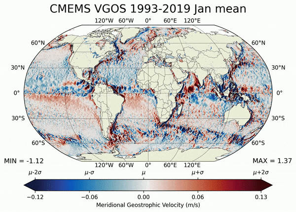
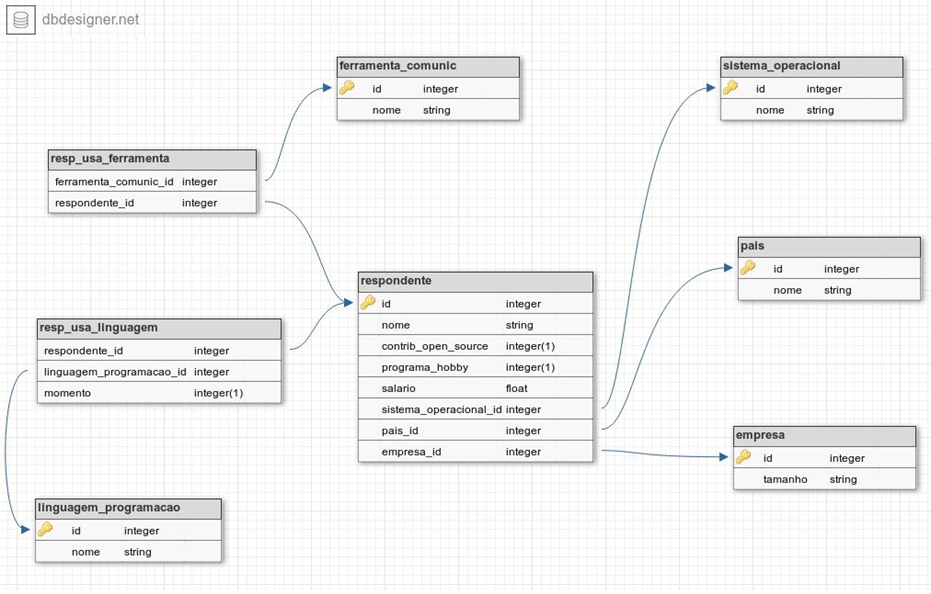
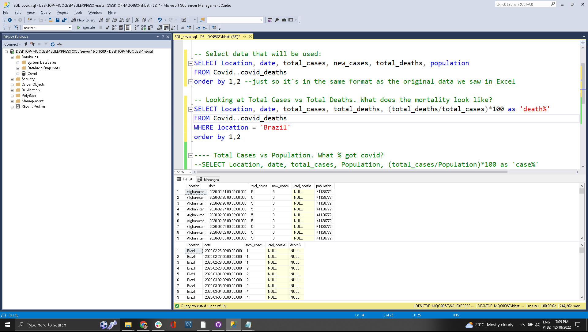
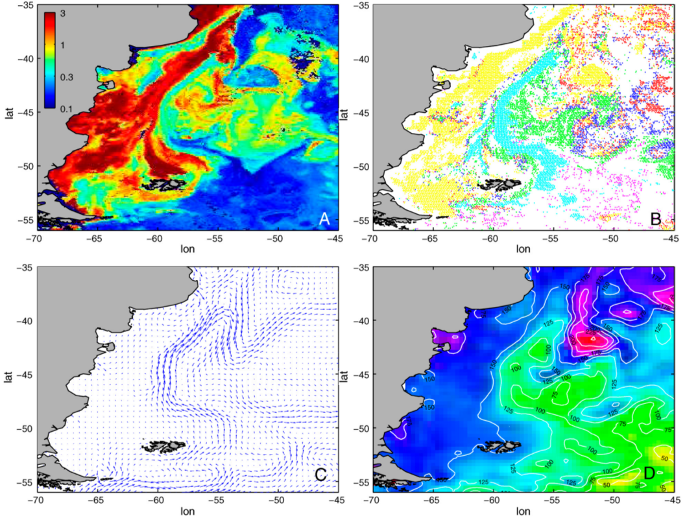
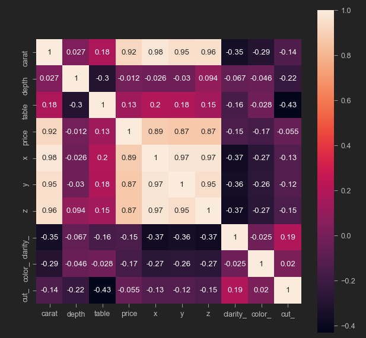

<h1 align="center">Hi, I'm Henrique 👋</h1>

<h3 align="center">Data Engineer · pipelines, cloud ETL & real-time data</h3>

  
  
  

🔹 :ocean: I have an **Ocean/Environmental Sciences** academic background; BSc in **Oceanography** from the University of São Paulo  
🔹 ⚓ <b>Data Engineer at the Brazilian Navy (CHM)</b> - Automated data pipelines: real-time ingestion from telemetry, quality control, and APIs 
🔹 📋 DataViz and dashboards for monitoring and analysis 
🔹 :bar_chart: I've worked as a TA/Specialist Instructor and as an Oceanographic Data Analyst in BC, Canada  
🔹 :desktop_computer: Started delving into Data Science through the **Ironhack** bootcamp  
🔹 🤘 Certified Glider and Sailbuoy pilot

---

As an oceanographer I've focused mostly on remote sensing and large-to-meso-scale Geophysical Fluid Dynamics. I started programming with C, MATLAB and R in a physical-oceanography lab, and Python became my daily tool for everything from remote sensing to data engineering. Along the way the toolbox grew into standard practice: **Pyenv, Pip/Venv, Poetry and Git** for reproducibility; **NumPy, Pandas, Matplotlib, Seaborn** for analysis; **XArray + Dask** for large HDF5/NetCDF/Zarr datasets and lazy computation; and orchestration with **CRON, Airflow and Docker** as scripts grew into pipelines - all in a Linux environment.

Git is a given for coding work, and GitHub doubles as a portfolio, so I've grouped some projects below in case you're curious.
Boris Cherny from Claude Code has famously said that *"coding is largely solved."* So if you're a client or recruiter wondering *"why would I need a data engineer, then?"* - here's my honest answer:

- **Writing code syntax was never the hard part*: it's mechanical, and yes, AI does a lot of it now.
- **The hard part is modelling the problem correctly**: defining boundaries, understanding data flow, anticipating failure modes, and designing systems that *survive change*.
- Understanding a system deeply (why a function exists, what assumptions it makes, what happens when inputs are invalid) is what keeps a pipeline reliable at 3 a.m.

 

<h1 align="center">Featured Projects</h1>

<table>
  <tr>
    <td width="50%" valign="top">
      <h4 align="center">🏃 runsight - Garmin activity analytics</h4>
      

      
A production-grade Python package that pulls Garmin activity data and turns it into analytics. Proper <code>src/</code> layout, tests, CI, and a packaged CLI - the way I structure real projects.

      
<strong>Python · pytest · CI · packaging</strong>

      

        
      

    </td>
    <td width="50%" valign="top">
      <h4 align="center">⚡ 1 Billion Rows Challenge</h4>
      

      
Aggregating one billion rows - and benchmarking how far you can push it with pure Python vs Pandas, Polars, DuckDB and Dask. Performance engineering and knowing the right tool for scale.

      
<strong>Python · Polars · DuckDB · Dask</strong>

      

        
      

    </td>
  </tr>

  <tr>
    <td width="50%" valign="top">
      <h4 align="center">🛰️ CMEMS Altimetry - Rossby waves</h4>
      

      

      
Global monthly climatologies of geostrophic velocities from CMEMS altimetry, plus Hovmöller diagrams that make first-mode baroclinic Rossby waves visible. Large NetCDF handling with XArray + Dask.

      
<strong>Python · XArray · Dask · NetCDF</strong>

      

        
      

    </td>
    <td width="50%" valign="top">
      <h4 align="center">🐍 FastAPI + TDD</h4>
      

      
An async REST API built test-first with FastAPI, Pydantic and pytest - clean structure, typed schemas, and tests driving the design. How I build the API layer that sits on top of a pipeline.

      
<strong>FastAPI · Pydantic · pytest · async</strong>

      

        
      

    </td>
  </tr>

  <tr>
    <td width="50%" valign="top">
      <h4 align="center">📊 Ironhack Final Project - data bank</h4>
      

      

      
A fintech case (AME-Digital / Stack Overflow 2018 Dev Survey): designed the data bank, ran the SQL, visualized the answers and built a predictive model - end to end.

      
<strong>Python · MySQL · Tableau</strong>

      

        
      

    </td>
    <td width="50%" valign="top">
      <h4 align="center">🦠 COVID-19 SQL</h4>
      

      

      
Exploratory analysis of a COVID-19 dataset in SQL - joins, CTEs, temp tables, window &amp; aggregate functions, views and type conversions. The SQL fundamentals a data role runs on.

      
<strong>SQL · MS SQL Server · Tableau</strong>

      

        
      

    </td>
  </tr>

  <tr>
    <td width="50%" valign="top">
      <h4 align="center">🔬 PHYSAT - honours thesis</h4>
      

      

      
Code from my honours thesis - "1st-mode baroclinic Rossby waves modify the composition of Phytoplankton Functional Groups" - pairing altimetry with a bio-algorithm that classifies phytoplankton by spectral signature.

      
<strong>MATLAB · remote sensing</strong>

      

        
      

    </td>
    <td width="50%" valign="top">
      <h4 align="center">💎 Linear Regression - diamond prices</h4>
      

      

      
Predicting diamond prices with a linear-regression pipeline - EDA, feature engineering, model fitting and evaluation on a clean, documented workflow.

      
<strong>Python · scikit-learn · Pandas</strong>

      

        
      

    </td>
  </tr>
</table>

---

<b>so what's your deal, man? 🤔 (a bit of personality)</b>

 

My deal is **mindmaps** - from literature reviews of scientific papers to organizing how I learn new tech. There's good evidence that this leverages spatial and visual memory in complementary ways ([Dresler et al., 2018](https://pmc.ncbi.nlm.nih.gov/articles/PMC5439266/)). Listen, Geophysical Fluid Dynamics is hard enough, and I'm not particularly savvy, but my _sister_ is, so I'll take a hint from someone who has a postdoc in neurobiology and take any advantage I can get. Cognitive architecture is a vibrant field and I suspect they're on to something.

---

  <h1 align="center">Tech Stack</h1>

  <table align="center" style="width: 100%; table-layout: fixed; border-spacing: 10px;">
    <tr>
      <td style="width: 50%; vertical-align: top;">
        <h2 align="center">Programming & Data Processing</h2>
        

          
          
          
          
          
          
          
        

      </td>
      <td style="width: 50%; vertical-align: top;">
        <h2 align="center">Databases</h2>
        

          
          
          
          
          
        

      </td>
    </tr>
    <tr>
      <td style="width: 50%; vertical-align: top;">
        <h2 align="center">Data Engineering & Automation</h2>
        

          
          
          
          
          
        

      </td>
      <td style="width: 50%; vertical-align: top;">
        <h2 align="center">Cloud & APIs</h2>
        

          
          
          
        

      </td>
    </tr>
    <tr>
      <td style="width: 50%; vertical-align: top;">
        <h2 align="center">Visualization & BI</h2>
        

          
          
          
          
        

      </td>
      <td style="width: 50%; vertical-align: top;">
        <h2 align="center">Systems & Tools</h2>
        

          
          
          
          
          
        

      </td>
    </tr>
  </table>

  <table align="center" style="width: 80%; table-layout: fixed;">
    <tr>
      <td style="text-align: center; padding: 15px;">
        <h2 align="center">Currently exploring…</h2>
        

          
          
          
        

      </td>
    </tr>
  </table>

---

<h1 align="center">GitHub Stats</h1>

<table align="center">
  <tr>
    <td>
      
    </td>
    <td>
      
    </td>
  </tr>
</table>

📫 Reach me: <a href="mailto:hbatistuzzo@gmail.com">hbatistuzzo@gmail.com</a> · <a href="https://www.linkedin.com/in/henrique-batistuzzo/">LinkedIn</a> · <a href="http://api.whatsapp.com/send?phone=5511981126990">WhatsApp</a>

