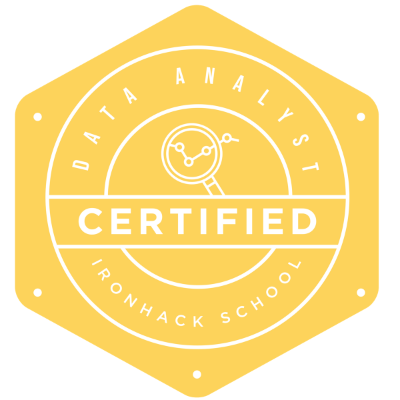

<h1 align="center"> 
	Hi there, I'm Henry  
</h1>

<h3 align="center">... I'm currently delving into Data Science 🖖 </h3> 

🔹 :ocean: I have an **Ocean/Environmental Sciences** academic background; BSc in **Oceanography** from the University of São Paulo  
🔹 ⚓: Currently working at the Brazilian Navy-DHN as an oceanographic data analyst  
🔹 :desktop_computer: Completed a bootcamp in Data Analytics through **Ironhack**  
🔹 :bar_chart: I've worked as a TA/Specialist Instructor and as an Oceanographic Data Analyst in BC, Canada  
🔹 📋 This is where I’m building a portfolio in Data Analysis, Data Science and Data Engineering  
🔹 🤘 4th kyu in codewars. It ain't easy 😢!  
🔹 Currently learning more about Docker, Kubernetes and their use in cloud environments  

<a href=""></a>

As an oceanographer I've focused mostly on remote sensing and large-to-meso-scale Geophysical Fluid Dynamics. I started programming with C, MatLab and some R but nowadays I use Python as a tool of choice on a daily basis both for oceanography and data science. Along the way I've picked up some tools whose usage has become ubiquitous across projects: Pyenv, Pip + Venv, Pipx, Poetry and Git (of course). Docker is becoming increasingly useful. Windows or Linux? Both. I've started a migration from dual boot --> VMs --> WSL2, which I currently use within VSCode, and it's the best thing ever. If you're _really_ interested in what I do, I keep a [portfolio hosted here](https://hbatistuzzo.github.io/); mind you, it currently works properly on desktop, but it's weird on mobile, because React is arcane and outside of my domain (hey at least I've tried, gimme a break! We'll get there)

Feel free to message me on whatsapp here  <a href="">[][whatsapp] or contact me through any of these links below:

  <a href=""></a>
  <a href=""></a>
  <a href=""></a>
  <a href=""></a>
  <a href=""></a>

<h1 align="center">GitHub Stats</h1>

  <a href="https://github.com/hbatistuzzo">

  

---

<h1 align="center">What's your deal, man? 🤔</h1> 

Glad you've asked! My deal is mindmaps.   
Mindmaps everywhere, from conducting the literature review of scientific articles to organizing the study of data science topics. The [method of loci](https://en.wikipedia.org/wiki/Method_of_loci) is well established in neuroscience, and by creating blueprints for a mind-palace with mind-maps, this method leverages spatial and visual memory in complementary ways, as corroborated in [Dresler et al, 2018](https://pmc.ncbi.nlm.nih.gov/articles/PMC5439266/).    
Listen, Geophysical Fluid Dynamics is hard enough, and I'm not particularly smart, but my _sister_ is, so I'll take a hint from someone who has a postdoc in neurobiology and take any advantage I can get. Cognitive architecture is a vibrant field and I suspect they're on to something.

        

 

I've used it to study and learn the tools in the Tech Stack section below 👇 and to organize the projects showcased beyond that.

 

  <h1 align="center">Tech Stack</h1>

<table align="center" style="width: 80%; table-layout: fixed;">
  <tr>
    <td style="padding: 20px;">
      <h2 align="center"> Currently Learning...</h2>
      

        
	
	
	
      

    </td>
  </tr>
</table>
          
  <table align="center" style="width: 100%; table-layout: fixed; border-spacing: 10px;">
    <tr>
      <td style="width: 50%; vertical-align: top;">
        <h2 align="center">Programming & Data Processing</h2>
        

          
          
          
          
          
          
          
          
        

      </td>
      <td style="width: 50%; vertical-align: top;">
        <h2 align="center">Visualization & Business Intelligence</h2>
        

          
          
          
          
        

      </td>
    </tr>
    <tr>
      <td style="width: 50%; vertical-align: top;">
        <h2 align="center">Databases</h2>
        

          
          
          
          
        

      </td>
      <td style="width: 50%; vertical-align: top;">
        <h2 align="center">Data Engineering & Automation</h2>
        

          
          
        

      </td>
    </tr>
    <tr>
      <td style="width: 50%; vertical-align: top;">
        <h2 align="center">Systems & Development Tools</h2>
        

          
          
          
        

      </td>
      <td style="width: 50%; vertical-align: top;">
        <h2 align="center">Miscellaneous</h2>
        

          
          
          
        

      </td>
    </tr>
    <tr>
      <td style="width: 50%; vertical-align: top;">
        <h2 align="center">API's</h2>
        

      	
      	
        

      </td>
      <td style="width: 50%; vertical-align: top;">
        <h2 align="center">Cloud Services</h2>
        

          
        

      </td>
    </tr>
  </table>

          

<table align="center" style="width: 80%; table-layout: fixed;">
  <tr>
    <td style="text-align: center; padding: 20px;">
      <h2 align="center"> Some (some) experience with.. </h2>
      

	
        
	
	
	
	
	
	
	
	
	
	
      

    </td>
  </tr>
</table>
          

<table align="center" style="width: 80%; table-layout: fixed;">
  <tr>
    <td style="text-align: center; padding: 20px;">
      <h2 align="center"> Planning on learning </h2>
      

	
      

    </td>
  </tr>
</table>

---

[whatsapp]: http://api.whatsapp.com/send?phone=5511981126990

<!---

-->

<h1 align="center">Projects</h1> 
<table>
  
  <tr>
    <td width="50%" valign="top">
      <h4 align="center">Rossby waves in Absolute Dynamic Topography data</h4>
         
	

        
	

         
        

I've used CMEMS altimetry data to create functions that plot global monthly climatologies of zonal and meridional geostrophic velocities. The absolute dynamic topography variable was used to construct hovmöller diagrams in latitudes with strong signals in the low-frequency energy spectrum. Rossby waves can then be visualized in this format. You can check it on the repo below. 

      

        <strong> Technologies used </strong>
         
        
	
	
	
      

      

        <strong> IDE used </strong>
         
        
      

      

    
      

    </td>
	<td width="50%" valign="top">
      <h4 align="center">Ironhack Final Project: Viz, SQL queries, Predictive Model</h4>
         
	

        
	

         
        
This project came from the fintech AME-Digital's case for Data Engineers based on Stack Overflow's 2018 Dev Survey. Case specific goals: answering questions regarding average salary of respondents, where they are from, what technologies and communication tools they use etc.  Repo below:

      

	  
        <strong> Technologies used </strong>
         
        
	
	
	
      

      

        <strong> IDE used </strong>
         
        
      

      

    
  </tr>
  
  <tr>
    <td width="50%" valign="top">
      <h4 align="center">PHYSAT: Honours' Thesis Project</h4>
         
	

        
	

         
        
Codes used in my honours' thesis "1st mode baroclinic Rossby waves modify the composition of Phytoplancton Functional Groups". Altimetry data is used in tandem with a bioalgorithm that classifies phytoplankton groups based on their spectral signature. Repo below:

      

        <strong> Technologies used </strong>
         
        
      

      

        <strong> IDE used </strong>
         
	
      

      

    
      

    </td>
<td width="50%" valign="top">
      <h4 align="center">Linear regression model data</h4>
         
	

        
	

         
        
Predict the price of the diamonds in rick_diamonds.csv using the information from diamonds.csv through a linear regression model.

 
 
	

        <strong> Technologies used </strong>
         
        
	
      

      

        <strong> IDE used </strong>
         
        
      

      

    
  </tr>

 <tr>
    <td width="50%" valign="top">
      <h4 align="center">Machine Learning: Rain in Australia</h4>
         
	

        
	

         
        
Given that it rains today, will it rain again tomorrow?
Real-time accurate rainfall prediction is challenging due to the inherent non-linear nature of weather. Using a database of meteorological variables in different cities of
Australia, the goal of this project is to train a model on short-term rainfall prediction (forecasting range up to 72 hours).

 
	

        <strong> Technologies used </strong>
         
        
	
	
	

      

        <strong> IDE used </strong>
         
        
      

      

    
</td>
<td width="50%" valign="top">
      <h4 align="center">COVID-19 SQL Project</h4>
         
	

        
	

         
        
Exploratory Analysis of a Covid-19 Dataset using SQL. I've done this project to showcase my skills related to: Joins, CTE's, Temporary Tables, Windows Functions, Aggregate Functions, Creating Views and Converting Data Types.

 
 
 
	

        <strong> Technologies used </strong>
         
        
	
	
	

      

        <strong> IDE used </strong>
         
        
      

      

    
   </td>
  </tr>

</table>
 
 

